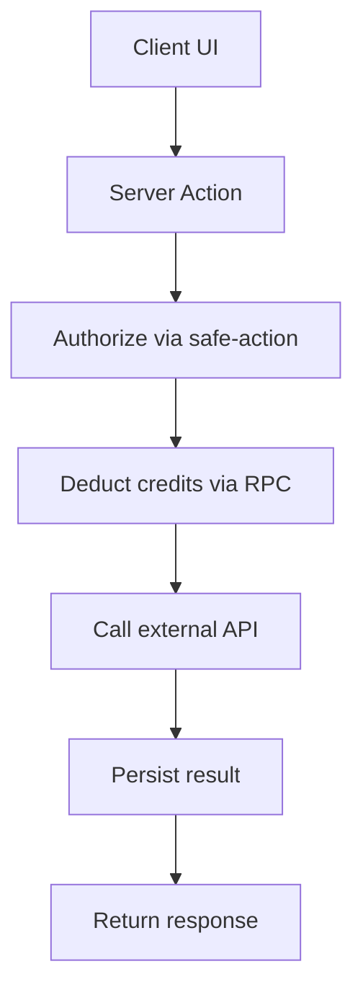

# MASTER_REFACTOR_PLAN.md (BlogSpy)

> **Last CT Scan:** 2026-01-XX | **Status:** CRITICAL issues require immediate attention

## 0) Executive Summary

### 🔴 CRITICAL FINDINGS (Ship Blockers)
1. **AI Writer Credits Use localStorage** - Users can manipulate credits via DevTools
2. **API Routes Missing Auth** - YouTube/TikTok routes have no authentication
3. **Duplicate Primitives** - Two `safe-action.ts` files with different implementations
4. **GeoScore Formula Inconsistency** - Two different algorithms producing different scores
5. **Feature-Local Credit Systems** - News/Social trackers bypass canonical DB credits

### 🟡 WARNING FINDINGS (Tech Debt)
1. Services using `apiClient` without `server-only` import (data leak risk)
2. Empty/stub service implementations in production code
3. AI Visibility actions bypass `authAction` wrapper
4. Middleware only protects `/dashboard/*` (other routes unprotected)

### 🟢 CLEAN AREAS
1. Keyword Research services - proper `server-only` usage
2. UI components library - consistent patterns
3. Rate limiting - Upstash implementation is solid
4. Credit deduction RPC - atomic with proper history logging

---

## 1) Repo-wide ratings table

| Area | Rating | Why | Key links |
|---|---:|---|---|
| [`app/`](app) | 🔴 | Dashboard protection appears client-side only; no enforced middleware; risk of unauthenticated access assumptions | [`app/dashboard/layout.tsx`](app/dashboard/layout.tsx:1) |
| [`src/features/`](src/features) | 🟡 | Strong feature modularization, but uneven auth/billing patterns; needs standardization | [`src/features/keyword-research/actions/refresh-keyword.ts`](src/features/keyword-research/actions/refresh-keyword.ts:1) |
| [`lib/`](lib) | 🔴 | Duplicated primitives and dev-mode toggles that must not ship | [`lib/safe-action.ts`](lib/safe-action.ts:1), [`lib/feature-access.ts`](lib/feature-access.ts:1) |
| [`src/lib/`](src/lib) | 🟡 | Intended destination for core primitives, but still coexists with `lib/` duplicates | [`src/lib/safe-action.ts`](src/lib/safe-action.ts:1), [`src/lib/supabase/server.ts`](src/lib/supabase/server.ts:1) |
| [`services/`](services) | 🟡 | Potential overlap with `src/features/*/services`; risk of parallel APIs | [`services/dataforseo/client.ts`](services/dataforseo/client.ts:1) |
| [`store/`](store) | 🟡 | Multiple state stores (global + feature-local) can drift; needs conventions | [`store/index.ts`](store/index.ts:1) |
| [`prisma/`](prisma) | 🟡 | Prisma schema exists but appears misaligned with Supabase-first tables | [`prisma/schema.prisma`](prisma/schema.prisma:1) |
| [`supabase/`](supabase) | 🔴 | Credits migration defines RLS policies via `current_setting` that may not be set; production correctness risk | [`supabase/migrations/002_user_credits_system.sql`](supabase/migrations/002_user_credits_system.sql:213) |
| [`config/`](config) | 🟡 | Needs tighter coupling with env validation and server/client split | [`config/env.ts`](config/env.ts:1) |
| [`contexts/`](contexts) | 🟡 | Auth appears client-driven; should not be sole enforcement | [`contexts/auth-context.tsx`](contexts/auth-context.tsx:1) |
| [`components/`](components) | 🟢 | UI library surface looks consistent; low risk relative to auth/billing | [`components/ui/button.tsx`](components/ui/button.tsx:1) |
| [`types/`](types) | 🟡 | Supabase types referenced from `src/lib`; ensure generated + consistent | [`types/supabase.ts`](types/supabase.ts:1) |
| [`proxy.ts`](proxy.ts) | 🔴 | Demo-mode bypass + not wired properly | [`proxy.ts`](proxy.ts:92) |
| [`tsconfig.json`](tsconfig.json) | 🟢 | Excluding backups reduces build fragility | [`tsconfig.json`](tsconfig.json:1) |

---

## 2) Global architecture findings (decisions + refactor shape)

### 2.1 Routing + route protection
- Current state
  - A proxy-like file exists but does not run as middleware: [`proxy.ts`](proxy.ts:92).
  - It hardcodes demo mode: [`proxy.ts`](proxy.ts:104).
  - There is no `middleware.ts` in repo root (so there is no universal request-time protection).
- Direction
  - Enforce protection at two layers:
    1) Request-time middleware for `/dashboard/*` and sensitive API routes.
    2) Server Actions auth guard as the hard boundary.
- Immediate action
  - Either convert logic into [`middleware.ts`](middleware.ts:1) or remove proxy approach and implement canonical Next middleware directly.

### 2.2 Server Actions standard (single wrapper)
- Decision
  - Standardize on [`src/lib/safe-action.ts`](src/lib/safe-action.ts:1) and migrate away from [`lib/safe-action.ts`](lib/safe-action.ts:1).
- Why
  - Two wrappers have different rate-limits and error semantics (risk of feature drift).

### 2.3 Supabase server client standard (single source of truth)
- Decision
  - Standardize on [`src/lib/supabase/server.ts`](src/lib/supabase/server.ts:1).
- Issues to resolve
  - Env key name mismatch: [`lib/supabase/server.ts`](lib/supabase/server.ts:16) uses `SUPABASE_SERVICE_KEY`, while [`src/lib/supabase/server.ts`](src/lib/supabase/server.ts:97) uses `SUPABASE_SERVICE_ROLE_KEY`.
  - “Clerk” helpers are actually Supabase wrappers and currently use non-null assertions: [`lib/clerk.ts`](lib/clerk.ts:12).

### 2.4 Mock gating and env config
- Current state
  - Server-side mock gating uses both `USE_MOCK_DATA` and `NEXT_PUBLIC_USE_MOCK_DATA`: [`src/features/keyword-research/actions/refresh-keyword.ts`](src/features/keyword-research/actions/refresh-keyword.ts:33).
- Direction
  - Server behavior should be controlled by server-only env (no `NEXT_PUBLIC_*` gating for server logic).

---

## 3) Billing/Credits correctness model (single system)

### 3.1 Source of truth
- Database tables + RPC:
  - [`supabase/migrations/002_user_credits_system.sql`](supabase/migrations/002_user_credits_system.sql:1)
  - RPC: [`use_credits`](supabase/migrations/002_user_credits_system.sql:125)

### 3.2 Known correctness gaps
- Keyword refresh charges after external call (race window): [`src/features/keyword-research/actions/refresh-keyword.ts`](src/features/keyword-research/actions/refresh-keyword.ts:116).
- Fallback charge path does not log `credit_usage_history`: [`src/features/keyword-research/actions/refresh-keyword.ts`](src/features/keyword-research/actions/refresh-keyword.ts:83).
- Feature-local credit systems exist (must not ship as separate billing truths):
  - News Tracker in-memory: [`src/features/news-tracker/services/credit.service.ts`](src/features/news-tracker/services/credit.service.ts:147)
  - Social Tracker mock store: [`src/features/social-tracker/credits/services/balance.service.ts`](src/features/social-tracker/credits/services/balance.service.ts:1)

### 3.3 Target flow



---

## 4) Test strategy (guardrails for refactors)

### 4.1 Unit tests (pure logic)
- Target
  - Credits helpers: remaining calculation, plan limits interpretation.
  - Deterministic scoring utilities (SERP feature parsing, GEO score calculations).
- Constraint
  - Keep tests pure; no Supabase/DataForSEO network calls.

### 4.2 Contract tests (auth + credits invariants)
- Auth invariants
  - Any `authAction`-protected action rejects unauthenticated callers: [`authAction`](src/lib/safe-action.ts:123).
  - Any admin action rejects non-admin role: [`adminAction`](src/lib/safe-action.ts:165).
- Credits invariants
  - RPC rejects when remaining < amount: [`use_credits`](supabase/migrations/002_user_credits_system.sql:153).
  - Every successful deduction creates a history record: [`credit_usage_history`](supabase/migrations/002_user_credits_system.sql:40).
- How
  - Introduce a thin credits adapter in [`src/lib/`](src/lib) so actions don’t talk to Supabase RPC directly.

### 4.3 Smoke tests
- Build must pass: [`package.json`](package.json:8).
- Minimal server-render checks for dashboard shells: [`app/dashboard/layout.tsx`](app/dashboard/layout.tsx:1).

---

## 5) Feature-by-feature scorecards (initial pass)

### 5.1 [`src/features/keyword-research/`](src/features/keyword-research)
- Rating: 🔴
- Why
  - Billing correctness risks in refresh flow: [`src/features/keyword-research/actions/refresh-keyword.ts`](src/features/keyword-research/actions/refresh-keyword.ts:116).
  - Uses root-level safe action wrapper today: [`src/features/keyword-research/actions/refresh-keyword.ts`](src/features/keyword-research/actions/refresh-keyword.ts:8).

### 5.2 [`src/features/ai-visibility/`](src/features/ai-visibility)
- Rating: 🟡
- Why
  - Actions use direct Supabase auth instead of standardized safe-action flow: [`src/features/ai-visibility/actions/run-audit.ts`](src/features/ai-visibility/actions/run-audit.ts:23).

### 5.3 [`src/features/news-tracker/`](src/features/news-tracker)
- Rating: 🔴
- Why
  - Separate in-memory billing system; must converge to canonical credits tables/RPC: [`src/features/news-tracker/services/credit.service.ts`](src/features/news-tracker/services/credit.service.ts:147).

### 5.4 [`src/features/social-tracker/`](src/features/social-tracker)
- Rating: 🟡
- Why
  - Mock credit balance service implies billing is not real yet; must converge: [`src/features/social-tracker/credits/services/balance.service.ts`](src/features/social-tracker/credits/services/balance.service.ts:1).

### 5.5 Other features
- Rating: 🟡 (default until audited)
- Rationale
  - Many features likely share the same architectural risks (auth/billing/env) but haven’t been deeply inspected.

---

## 6) CRITICAL 🔴 TODOs (ship blockers)

1) 🔴 Enforce real route protection
- Why: Current request-time protection is effectively disabled.
- Action:
  - Implement [`middleware.ts`](middleware.ts:1) to protect `/dashboard/*` and any privileged routes.
  - Remove or rewrite demo bypass in [`proxy.ts`](proxy.ts:104).
- Acceptance criteria:
  - Unauthenticated request to `/dashboard` redirects or returns 401.
  - Privileged APIs/actions cannot execute without auth.
- Anchors:
  - [`proxy.ts`](proxy.ts:92)
  - [`app/dashboard/layout.tsx`](app/dashboard/layout.tsx:1)

2) 🔴 Standardize safe actions to [`src/lib/safe-action.ts`](src/lib/safe-action.ts:1)
- Why: Two wrappers create drift and inconsistent protections.
- Action:
  - Make [`lib/safe-action.ts`](lib/safe-action.ts:1) a thin re-export to [`src/lib/safe-action.ts`](src/lib/safe-action.ts:1) (temporary), then migrate imports.
- Acceptance criteria:
  - No remaining imports of [`lib/safe-action.ts`](lib/safe-action.ts:1) in application code.

3) 🔴 Standardize Supabase server client to [`src/lib/supabase/server.ts`](src/lib/supabase/server.ts:1)
- Why: Two implementations + mismatched env keys.
- Action:
  - Replace usage of [`createClient`](lib/supabase/server.ts:35) with [`createServerClient`](src/lib/supabase/server.ts:61) (or expose a compatibility alias).
  - Align service-role env key usage.
- Acceptance criteria:
  - Single server client implementation used everywhere.

4) 🔴 Fix credits deduction semantics for keyword refresh
- Why: Race window + missing audit logging in fallback path.
- Action:
  - Move to atomic RPC-first deduction; remove best-effort update path.
  - Ensure history log always written.
- Acceptance criteria:
  - Every refresh attempt either:
    - Fails before external call if insufficient credits, or
    - Deducts credits exactly once and logs history.
- Anchors:
  - [`src/features/keyword-research/actions/refresh-keyword.ts`](src/features/keyword-research/actions/refresh-keyword.ts:61)
  - [`use_credits`](supabase/migrations/002_user_credits_system.sql:125)

5) 🔴 Eliminate feature-local billing systems in favor of canonical credits
- Why: Multiple sources of truth will produce revenue leakage or false blocks.
- Action:
  - Replace News Tracker credits logic with canonical RPC.
- Acceptance criteria:
  - News Tracker credit checks/deductions are backed by `user_credits` and `credit_usage_history`.
- Anchors:
  - [`src/features/news-tracker/services/credit.service.ts`](src/features/news-tracker/services/credit.service.ts:147)

6) 🔴 Fix AI Writer Credits - USING LOCALSTORAGE (CRITICAL SECURITY)
- Why: Credits stored in browser localStorage can be manipulated by users
- Current State: `creditsService` in [src/features/ai-writer/services/index.ts](src/features/ai-writer/services/index.ts#L234-L280) uses `window.localStorage`
- Action:
  - Migrate to canonical `use_credits` RPC in Supabase
  - Remove all localStorage credit logic
  - Wire up proper server-side credit deduction in AI Writer actions
- Acceptance criteria:
  - No credit operations in client-side code
  - All AI Writer operations deduct via `use_credits` RPC
- Anchors:
  - [src/features/ai-writer/services/index.ts#L234](src/features/ai-writer/services/index.ts#L234) - `readCreditBalance()` using localStorage
  - [src/features/ai-writer/services/index.ts#L246](src/features/ai-writer/services/index.ts#L246) - `writeCreditBalance()` using localStorage

7) 🔴 Add Auth to API Routes
- Why: YouTube/TikTok routes accept unauthenticated requests
- Current State: [src/features/video-hijack/api/youtube/route.ts](src/features/video-hijack/api/youtube/route.ts) has no auth check
- Action:
  - Add Supabase auth check at route entry
  - Return 401 for unauthenticated requests
- Acceptance criteria:
  - All API routes require valid session
- Anchors:
  - [src/features/video-hijack/api/youtube/route.ts#L25](src/features/video-hijack/api/youtube/route.ts#L25)
  - [src/features/video-hijack/api/tiktok/route.ts](src/features/video-hijack/api/tiktok/route.ts)

8) 🔴 Consolidate GeoScore Calculation Algorithms
- Why: Two different formulas produce inconsistent scores across features
- Formula A (keyword-research): AI Overview (40pts) + Featured Snippet (30pts) + Intent (20pts) + Word Count (10pts)
- Formula B (ai-writer): Country/city string matching + content length heuristic
- Action:
  - Define single canonical formula in `src/shared/geo-score/`
  - Import from shared location in both features
- Acceptance criteria:
  - Single `calculateGeoScore()` function used everywhere
- Anchors:
  - [src/features/keyword-research/utils/geo-calculator.ts#L33](src/features/keyword-research/utils/geo-calculator.ts#L33) - Formula A
  - [src/features/ai-writer/hooks/use-geo-aeo.ts#L41](src/features/ai-writer/hooks/use-geo-aeo.ts#L41) - Formula B

---

## 7) WARNING 🟡 TODOs (medium-term refactors)

1) 🟡 Remove or rewrite dev-only feature access toggles
- Why: Several helpers always return dev-friendly values.
- Action: tighten behavior behind env checks.
- Anchors: [`lib/feature-access.ts`](lib/feature-access.ts:54)

2) 🟡 Unify auth patterns in Server Actions
- Why: Some actions bypass standard wrappers.
- Action: migrate to [`authAction`](src/lib/safe-action.ts:123).
- Anchors: [`src/features/ai-visibility/actions/run-audit.ts`](src/features/ai-visibility/actions/run-audit.ts:23)

3) 🟡 Reduce module boundary ambiguity (`services/` vs `src/features/*/services`)
- Why: Two service layers can drift.
- Action: define ownership rules and move shared services into [`src/lib/`](src/lib).

4) 🟡 Add `server-only` to Services Using apiClient
- Why: Client-side imports could expose API logic/keys
- Services Missing Protection:
  - [src/features/snippet-stealer/services/snippet-stealer.service.ts](src/features/snippet-stealer/services/snippet-stealer.service.ts)
  - [src/features/schema-generator/services/schema.service.ts](src/features/schema-generator/services/schema.service.ts)
  - [src/features/rank-tracker/services/rank-tracker.service.ts](src/features/rank-tracker/services/rank-tracker.service.ts)
  - [src/features/on-page-checker/services/on-page.service.ts](src/features/on-page-checker/services/on-page.service.ts)
- Action: Add `import "server-only"` at top of each file
- Acceptance criteria: Build fails if imported in client component

5) 🟡 Implement Empty Service Files
- Why: Production code contains empty/stub implementations
- Empty Files:
  - [src/features/ai-writer/services/ai-writer.service.ts](src/features/ai-writer/services/ai-writer.service.ts) - EMPTY
  - [src/features/ai-writer/services/credits.service.ts](src/features/ai-writer/services/credits.service.ts) - EMPTY
  - [src/features/content-roadmap/services/index.ts](src/features/content-roadmap/services/index.ts) - EMPTY
- Stub Files:
  - [src/features/ai-writer/services/index.ts](src/features/ai-writer/services/index.ts) - 417 lines of localStorage stubs
- Action: Either implement real logic or remove files
- Acceptance criteria: No empty service exports

6) 🟡 Extend Middleware Protection
- Why: Only `/dashboard/*` is protected at edge level
- Current: [middleware.ts#L67](middleware.ts#L67) - `matcher: ["/dashboard/:path*"]`
- Unprotected routes that should require auth:
  - `/ai-writer/*`
  - `/keyword-magic/*`
  - `/rank-tracker/*`
  - `/content-roadmap/*`
  - `/settings/*`
- Action: Expand matcher or create route groups
- Acceptance criteria: All app routes require authentication

7) 🟡 Migrate AI Visibility to authAction Wrapper
- Why: Manual `supabase.auth.getUser()` in each function is error-prone
- Files affected:
  - [src/features/ai-visibility/actions/run-audit.ts](src/features/ai-visibility/actions/run-audit.ts) - 4 manual auth checks
  - [src/features/ai-visibility/actions/run-defense.ts](src/features/ai-visibility/actions/run-defense.ts) - 3 manual auth checks
  - [src/features/ai-visibility/actions/run-tracker.ts](src/features/ai-visibility/actions/run-tracker.ts) - 5 manual auth checks
  - [src/features/ai-visibility/actions/save-config.ts](src/features/ai-visibility/actions/save-config.ts) - 3 manual auth checks
  - [src/features/ai-visibility/actions/run-citation.ts](src/features/ai-visibility/actions/run-citation.ts) - 2 manual auth checks
  - [src/features/ai-visibility/actions/save-keyword.ts](src/features/ai-visibility/actions/save-keyword.ts) - 3 manual auth checks
- Action: Refactor to use `authAction` from `src/lib/safe-action.ts`
- Acceptance criteria: No direct `supabase.auth.getUser()` calls in actions

8) 🟡 Remove misleading naming and unsafe env assumptions
- Why: [`lib/clerk.ts`](lib/clerk.ts:1) is a Supabase auth helper and uses non-null assertions.
- Action: rename/migrate and add env validation.

9) 🟡 Add contract tests for credits/auth invariants
- Why: Prevent regression during consolidation.
- Action: implement tests described in section 4.

---

## 8) Feature-by-Feature CT Scan Results

### 🔴 CRITICAL Features

| Feature | Rating | Issues | Files |
|---------|--------|--------|-------|
| `ai-writer` | 🔴 | localStorage credits, empty services, stub implementations | [services/index.ts](src/features/ai-writer/services/index.ts) |
| `keyword-research` | 🔴 | Race condition in credit deduction, uses root safe-action | [actions/refresh-keyword.ts](src/features/keyword-research/actions/refresh-keyword.ts) |
| `news-tracker` | 🔴 | In-memory billing system bypasses DB | [services/credit.service.ts](src/features/news-tracker/services/credit.service.ts) |
| `video-hijack` | 🔴 | API routes have no authentication | [api/youtube/route.ts](src/features/video-hijack/api/youtube/route.ts) |

### 🟡 WARNING Features

| Feature | Rating | Issues | Files |
|---------|--------|--------|-------|
| `ai-visibility` | 🟡 | Manual auth instead of authAction (20+ instances) | [actions/run-audit.ts](src/features/ai-visibility/actions/run-audit.ts) |
| `social-tracker` | 🟡 | Mock credit balance service | [credits/services/balance.service.ts](src/features/social-tracker/credits/services/balance.service.ts) |
| `snippet-stealer` | 🟡 | Missing server-only import | [services/snippet-stealer.service.ts](src/features/snippet-stealer/services/snippet-stealer.service.ts) |
| `rank-tracker` | 🟡 | Missing server-only import | [services/rank-tracker.service.ts](src/features/rank-tracker/services/rank-tracker.service.ts) |
| `on-page-checker` | 🟡 | Missing server-only import | [services/on-page.service.ts](src/features/on-page-checker/services/on-page.service.ts) |
| `schema-generator` | 🟡 | Missing server-only import | [services/schema.service.ts](src/features/schema-generator/services/schema.service.ts) |
| `content-roadmap` | 🟡 | Empty services/index.ts | [services/index.ts](src/features/content-roadmap/services/index.ts) |

### 🟢 CLEAN Features

| Feature | Rating | Notes |
|---------|--------|-------|
| `keyword-research/services` | 🟢 | Proper server-only, authAction usage |
| `shared/geo-score/components` | 🟢 | Well-structured UI components |

---

## 9) Numbered TODO Checklist

### 🔴 CRITICAL (Must fix before production)

```
TODO-001: Fix AI Writer localStorage credits vulnerability
         File: src/features/ai-writer/services/index.ts
         Lines: 234-280
         Action: Replace localStorage with Supabase RPC

TODO-002: Add authentication to video-hijack API routes
         Files: src/features/video-hijack/api/youtube/route.ts
                src/features/video-hijack/api/tiktok/route.ts
         Action: Add supabase.auth.getUser() check

TODO-003: Standardize on src/lib/safe-action.ts
         Files: lib/safe-action.ts (DELETE)
                All imports pointing to lib/safe-action.ts
         Action: Migrate imports, then delete duplicate

TODO-004: Standardize on src/lib/supabase/server.ts
         Files: lib/supabase/server.ts (DELETE)
                lib/clerk.ts (DELETE or rename)
         Action: Align env keys, migrate imports

TODO-005: Fix keyword refresh credit race condition
         File: src/features/keyword-research/actions/refresh-keyword.ts
         Line: 116
         Action: Deduct credits BEFORE external API call

TODO-006: Migrate News Tracker to canonical credits
         File: src/features/news-tracker/services/credit.service.ts
         Action: Replace in-memory system with use_credits RPC

TODO-007: Consolidate GeoScore algorithms
         Files: src/features/keyword-research/utils/geo-calculator.ts
                src/features/ai-writer/hooks/use-geo-aeo.ts
         Action: Create src/shared/geo-score/calculator.ts

TODO-008: Implement middleware for all protected routes
         File: middleware.ts
         Action: Expand matcher to include all app routes
```

### 🟡 WARNING (Fix in next sprint)

```
TODO-009: Add server-only to snippet-stealer service
         File: src/features/snippet-stealer/services/snippet-stealer.service.ts
         Action: Add import "server-only" at line 1

TODO-010: Add server-only to rank-tracker service
         File: src/features/rank-tracker/services/rank-tracker.service.ts
         Action: Add import "server-only" at line 1

TODO-011: Add server-only to on-page-checker service
         File: src/features/on-page-checker/services/on-page.service.ts
         Action: Add import "server-only" at line 1

TODO-012: Add server-only to schema-generator service
         File: src/features/schema-generator/services/schema.service.ts
         Action: Add import "server-only" at line 1

TODO-013: Implement or delete empty AI Writer services
         Files: src/features/ai-writer/services/ai-writer.service.ts (EMPTY)
                src/features/ai-writer/services/credits.service.ts (EMPTY)
         Action: Implement real logic or remove files

TODO-014: Implement content-roadmap services
         File: src/features/content-roadmap/services/index.ts (EMPTY)
         Action: Implement service layer

TODO-015: Migrate AI Visibility to authAction wrapper
         Files: src/features/ai-visibility/actions/*.ts (6 files, 20+ manual checks)
         Action: Refactor to use authAction

TODO-016: Remove Social Tracker mock credits
         File: src/features/social-tracker/credits/services/balance.service.ts
         Action: Migrate to use_credits RPC

TODO-017: Remove/rename lib/clerk.ts
         File: lib/clerk.ts
         Action: This is Supabase, not Clerk - rename or delete

TODO-018: Align environment variable names
         Issue: SUPABASE_SERVICE_KEY vs SUPABASE_SERVICE_ROLE_KEY
         Action: Standardize on SUPABASE_SERVICE_ROLE_KEY
```

---

## 10) Implementation Sequencing

### Phase 1: Security (Week 1)
1. ✅ Fix localStorage credits (TODO-001)
2. ✅ Add API route auth (TODO-002)  
3. ✅ Expand middleware matcher (TODO-008)

### Phase 2: Consolidation (Week 2)
4. Standardize safe-action (TODO-003)
5. Standardize Supabase client (TODO-004)
6. Add server-only imports (TODO-009 to TODO-012)

### Phase 3: Credits System (Week 3)
7. Fix keyword refresh race (TODO-005)
8. Migrate News Tracker credits (TODO-006)
9. Migrate Social Tracker credits (TODO-016)

### Phase 4: Cleanup (Week 4)
10. Consolidate GeoScore (TODO-007)
11. Delete empty files or implement (TODO-013, TODO-014)
12. Migrate AI Visibility to authAction (TODO-015)
13. Cleanup naming (TODO-017, TODO-018)

---

## 11) Verification Checklist

After completing all TODOs, verify:

- [ ] `grep -r "window.localStorage" src/features/*/services` returns 0 results
- [ ] `grep -r "lib/safe-action" src/` returns 0 results (only src/lib/safe-action.ts)
- [ ] `grep -r "lib/supabase/server" src/` returns 0 results
- [ ] All API routes return 401 without valid session
- [ ] Middleware protects all `/app/*` routes
- [ ] Build passes with `pnpm build`
- [ ] All services importing `apiClient` have `server-only`
- [ ] Single GeoScore calculation used everywhere
