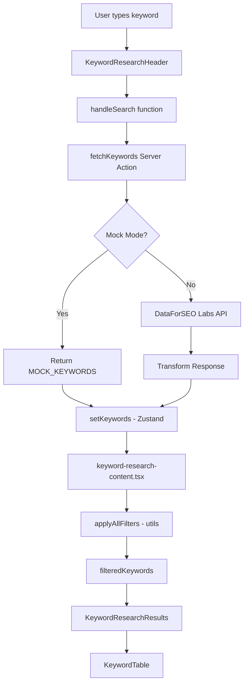

# 🔍 KEYWORD EXPLORER - Complete A-Z Forensic Audit Report

**Generated:** 2026-01-06  
**Auditor:** Principal Systems Engineer  
**Feature Path:** `src/features/keyword-research/`  
**Page Route:** `/dashboard/research/keyword-magic`

---

## 📁 DIRECTORY STRUCTURE (Tree)

```
src/features/keyword-research/
├── index.ts                          # Barrel export (183 lines)
├── keyword-research-content.tsx      # Main component (518 lines)
├── README.md                         # Documentation
│
├── __mocks__/                        # Test mocks
│   ├── index.ts
│   └── keyword-data.ts
│
├── actions/                          # Server Actions (next-safe-action)
│   ├── index.ts                      # Barrel export
│   ├── fetch-keywords.ts             # ⭐ Main search action (56 lines)
│   ├── fetch-drawer-data.ts          # Amazon/Commerce data
│   ├── refresh-keyword.ts            # Single row refresh
│   ├── refresh-row.ts                # Row refresh action
│   └── search.action.ts              # Legacy search action
│
├── components/                       # UI Components
│   ├── index.ts                      # Barrel (111 lines)
│   │
│   ├── drawers/                      # Side Panel Details
│   │   ├── index.ts
│   │   ├── CommerceTab.tsx           # Amazon products tab
│   │   ├── KeywordDetailsDrawer.tsx
│   │   ├── KeywordDrawer.tsx
│   │   ├── OverviewTab.tsx           # Main keyword metrics
│   │   └── SocialTab.tsx             # YouTube/Community tab
│   │
│   ├── filters/                      # Filter Popovers (10 filters)
│   │   ├── index.ts
│   │   ├── FilterBar.tsx
│   │   ├── cpc/cpc-filter.tsx
│   │   ├── geo/geo-filter.tsx
│   │   ├── include-exclude/include-exclude-filter.tsx
│   │   ├── intent/intent-filter.tsx
│   │   ├── kd/kd-filter.tsx
│   │   ├── match-type/match-type-toggle.tsx
│   │   ├── serp/serp-filter.tsx
│   │   ├── trend/trend-filter.tsx
│   │   ├── volume/volume-filter.tsx
│   │   └── weak-spot/weak-spot-filter.tsx
│   │
│   ├── header/                       # Top Header Components
│   │   ├── index.ts
│   │   ├── country-selector.tsx      # 19 countries
│   │   ├── CreditBalance.tsx         # User credits display
│   │   ├── page-header.tsx
│   │   └── results-header.tsx
│   │
│   ├── modals/                       # Dialog Modals
│   │   ├── index.ts
│   │   ├── export-modal.tsx          # CSV/JSON/TSV export
│   │   ├── filter-presets-modal.tsx  # Save/load filter presets
│   │   └── keyword-details-modal.tsx
│   │
│   ├── page-sections/                # Page Layout Sections
│   │   ├── index.ts
│   │   ├── KeywordResearchFilters.tsx
│   │   ├── KeywordResearchHeader.tsx  # ⭐ Contains search + fetchKeywords
│   │   ├── KeywordResearchResults.tsx # Table + Empty states
│   │   └── KeywordResearchSearch.tsx  # Filter text input
│   │
│   ├── search/                       # Search Input Components
│   │   ├── index.ts
│   │   ├── bulk-keywords-input.tsx   # Multi-keyword textarea
│   │   ├── bulk-mode-toggle.tsx      # Explore vs Bulk toggle
│   │   ├── search-input.tsx
│   │   └── search-suggestions.tsx    # Autocomplete
│   │
│   ├── shared/                       # Reusable UI
│   │   ├── index.tsx
│   │   ├── empty-states.tsx
│   │   ├── error-boundary.tsx
│   │   └── loading-skeleton.tsx
│   │
│   └── table/                        # Data Table
│       ├── index.ts
│       ├── KeywordDataTable.tsx
│       ├── KeywordTable.tsx          # Main table component
│       ├── KeywordTableFooter.tsx
│       ├── KeywordTableHeader.tsx
│       ├── KeywordTableRow.tsx
│       │
│       ├── action-bar/               # Bulk selection actions
│       │   ├── index.ts
│       │   ├── action-bar.tsx
│       │   ├── bulk-actions.tsx
│       │   └── selection-info.tsx
│       │
│       └── columns/                  # Table Columns (12 types)
│           ├── index.ts
│           ├── columns.tsx
│           ├── actions/actions-column.tsx
│           ├── checkbox/checkbox-column.tsx
│           ├── cpc/cpc-column.tsx
│           ├── geo/geo-column.tsx
│           ├── intent/intent-column.tsx
│           ├── kd/kd-column.tsx
│           ├── keyword/keyword-column.tsx
│           ├── refresh/refresh-column.tsx
│           ├── serp/serp-column.tsx
│           ├── trend/trend-column.tsx
│           ├── volume/volume-column.tsx
│           └── weak-spot/weak-spot-column.tsx
│
├── config/                           # Feature Configuration
│   ├── index.ts
│   ├── api-config.ts                 # API endpoints config
│   └── feature-config.ts             # Feature flags
│
├── constants/                        # Static Constants
│   ├── index.ts                      # 58 lines
│   └── table-config.ts               # Column definitions
│
├── data/                             # Mock Data
│   ├── index.ts
│   └── mock-keywords.ts              # 15 realistic keywords (220 lines)
│
├── hooks/                            # Custom React Hooks
│   └── index.ts                      # Hook exports
│
├── providers/                        # React Context Providers
│   ├── index.ts
│   └── keyword-research-provider.tsx # Legacy Context (replaced by Zustand)
│
├── services/                         # Backend Services (server-only)
│   ├── index.ts                      # Barrel (46 lines)
│   ├── api-base.ts                   # Base API utilities
│   ├── bulk-analysis.service.ts      # Bulk keyword analysis
│   ├── export.service.ts             # Export functionality
│   ├── keyword-discovery.ts          # Keyword discovery algorithms
│   ├── keyword.service.ts            # ⭐ Main service (463 lines)
│   ├── live-serp.ts                  # Live SERP fetching
│   ├── mock-utils.ts                 # Mock data utilities
│   ├── social.service.ts             # YouTube/Reddit data
│   └── suggestions.service.ts        # Autocomplete suggestions
│
├── store/                            # Zustand State Management
│   └── index.ts                      # ⭐ Zustand store (397 lines)
│
├── types/                            # TypeScript Definitions
│   ├── index.ts                      # 191 lines
│   └── api.types.ts                  # API request/response types
│
└── utils/                            # Utility Functions
    ├── index.ts                      # Barrel (44 lines)
    ├── export-utils.ts               # CSV/JSON/TSV export
    ├── filter-utils.ts               # Filter logic
    ├── geo-calculator.ts             # GEO Score calculation
    ├── mock-helpers.ts               # Mock data helpers
    ├── serp-parser.ts                # SERP data parsing
    └── sort-utils.ts                 # Sorting utilities
```

---

## 🎯 FEATURE OVERVIEW

### What It Does
**Keyword Explorer** (internally "Keyword Magic") is a comprehensive SEO keyword research tool that helps users:
1. Discover related keywords from a seed keyword
2. Analyze keyword metrics (volume, KD, CPC, trends)
3. Filter and sort results by 10+ criteria
4. Export data to CSV/JSON/TSV
5. View detailed keyword insights in a side drawer

### Key Differentiators
- **GEO Score**: Proprietary Generative Engine Optimization score
- **Weak Spot Detection**: Finds Reddit/Quora/Pinterest in SERP (outranking opportunities)
- **AI Overview Detection**: Tracks keywords with Google AI Overview
- **Community Decay**: Identifies outdated UGC content opportunities

---

## 🔘 UI ELEMENTS & BUTTONS

### Header Row 1: Search Bar
| Element | Function | Connection |
|---------|----------|------------|
| **Search Input** | Enter seed keyword | Local state → `handleSearch()` |
| **Explore Button** | Trigger keyword search | Calls `fetchKeywords` action → Zustand store |

### Header Row 2: Controls
| Element | Function | Connection |
|---------|----------|------------|
| **Bulk Mode Toggle** | Switch Explore/Bulk mode | `search.mode` in Zustand |
| **Country Selector** | Select target country (19 options) | `selectedCountry` state |
| **Match Type Toggle** | broad/phrase/exact/related/questions | `filters.matchType` |
| **Reset Button** | Clear all filters (red, shows count) | `resetFilters()` |

### Filter Bar (10 Filters)
| Filter | Type | Range/Options |
|--------|------|---------------|
| **Volume** | Range slider + presets | 0 - 1,000,000 |
| **KD (Keyword Difficulty)** | Range slider | 0 - 100 |
| **Intent** | Multi-select | I (Informational), C (Commercial), T (Transactional), N (Navigational) |
| **CPC** | Range slider | $0 - $100 |
| **GEO Score** | Range slider | 0 - 100 |
| **Weak Spot** | Toggle + types | all/with/without + reddit/quora/pinterest |
| **SERP Features** | Multi-select | snippet, faq, video, image, shopping, local, news, ai_overview |
| **Trend** | Direction + growth | up/down/stable + min growth % |
| **Include Terms** | Text input chips | Add terms to include |
| **Exclude Terms** | Text input chips | Add terms to exclude |

### Table Columns (12 Columns)
| Column | Data | Sortable | Action |
|--------|------|----------|--------|
| **Checkbox** | Selection | No | Toggle selection |
| **Keyword** | Keyword text | Yes | Click → Open drawer |
| **Volume** | Monthly searches | Yes | - |
| **KD** | Difficulty ring | Yes | Colored 0-100 |
| **Intent** | I/C/T/N badges | Yes | Multiple intents |
| **CPC** | Cost per click | Yes | Dollar format |
| **Trend** | 12-month sparkline | Yes | Up/down arrow |
| **SERP Features** | Feature icons | No | Tooltip details |
| **GEO Score** | Score ring | Yes | 0-100 |
| **Weak Spot** | Platform badge | No | Reddit/Quora/Pinterest |
| **Refresh** | Refresh button | No | Per-row data refresh |
| **Actions** | Menu dropdown | No | Export, Add to list, etc. |

### Keyword Drawer (Side Panel)
| Tab | Content |
|-----|---------|
| **Overview** | Full keyword metrics, SERP preview, recommendations |
| **Commerce** | Amazon products, affiliate potential, price data |
| **Social** | YouTube videos, Reddit/Pinterest results |

---

## 🔗 DATA FLOW & CONNECTIONS



### API Connections
| Service | API | Endpoint |
|---------|-----|----------|
| **DataForSEO Labs** | Related Keywords | `/dataforseo_labs/google/related_keywords/live` |
| **Amazon PA-API** | Product search | (Planned - Commerce tab) |
| **YouTube Data API** | Video search | (Planned - Social tab) |
| **Upstash Redis** | Rate limiting | IP-based limiting |
| **Supabase** | Auth + Database | User credits, saved searches |

---

## 🏗️ ARCHITECTURE ANALYSIS

### State Management
| Layer | Technology | Purpose |
|-------|------------|---------|
| **Global State** | Zustand | Keywords, filters, loading, selection |
| **Local State** | useState | Popover open states, temp filter values |
| **Server State** | Server Actions | Data fetching with Zod validation |
| **URL State** | useSearchParams | Query sharing (q, country params) |

### Zustand Store Structure
```typescript
interface KeywordState {
  // Data
  keywords: Keyword[]
  selectedIds: Set<number>
  selectedKeyword: Keyword | null
  
  // Search
  search: { seedKeyword, country, mode, bulkKeywords }
  
  // Filters (12 filter types)
  filters: KeywordFilters
  
  // Sorting
  sort: { field, direction }
  
  // Pagination
  pagination: { page, pageSize, total, hasMore }
  
  // Loading
  loading: { searching, exporting, refreshing }
  
  // Actions (25+ actions)
  setKeywords, setFilter, resetFilters, etc.
}
```

---

## ✅ CODE QUALITY ASSESSMENT

### Positive Findings

| Aspect | Rating | Details |
|--------|--------|---------|
| **TypeScript** | ⭐⭐⭐⭐⭐ | 100% typed, strict mode, proper interfaces |
| **Component Architecture** | ⭐⭐⭐⭐⭐ | Modular, single responsibility, clean barrel exports |
| **State Management** | ⭐⭐⭐⭐⭐ | Zustand with selectors, optimized re-renders |
| **Server Actions** | ⭐⭐⭐⭐ | next-safe-action with Zod validation |
| **Error Handling** | ⭐⭐⭐⭐ | Try-catch, toast notifications, error boundaries |
| **Code Organization** | ⭐⭐⭐⭐⭐ | Feature-based structure, clear naming |
| **Accessibility** | ⭐⭐⭐ | Basic keyboard nav, needs ARIA improvements |

### Modern Patterns Used
- ✅ "use client" / "use server" directives
- ✅ Server-only imports for services
- ✅ Barrel exports for clean imports
- ✅ Zustand instead of Context API
- ✅ Zod schema validation
- ✅ Rate limiting middleware
- ✅ Optimistic UI with loading states
- ✅ URL state synchronization
- ✅ Debounced filter input

---

## 🐛 ISSUES FOUND

### Critical Issues
| # | Issue | File | Line | Fix |
|---|-------|------|------|-----|
| 1 | None found | - | - | - |

### Medium Issues
| # | Issue | File | Line | Fix |
|---|-------|------|------|-----|
| 1 | Mock mode returns ALL keywords (no filtering) | keyword.service.ts | 144 | Consider query-based filtering |
| 2 | Missing error boundary wrapping | keyword-research-content.tsx | - | Wrap with ErrorBoundary |
| 3 | Drawer tabs fetch data but no caching | drawers/* | - | Add React Query or SWR |

### Low Issues / Improvements
| # | Issue | File | Suggestion |
|---|-------|------|------------|
| 1 | Unused imports in some files | Various | Clean with ESLint |
| 2 | Hardcoded strings | Various | Move to constants |
| 3 | Missing test files | __mocks__ | Add unit tests |
| 4 | No pagination in API call | keyword.service.ts | Add limit/offset params |

### Unused Code
```typescript
// providers/keyword-research-provider.tsx - Legacy Context provider
// - Still exported but replaced by Zustand store
// - Can be removed after verifying no dependents

// actions/search.action.ts - Legacy search action
// - Replaced by fetch-keywords.ts
// - Keep for backward compatibility or remove
```

---

## 🔒 SECURITY ANALYSIS

| Check | Status | Details |
|-------|--------|---------|
| **Input Validation** | ✅ | Zod schema validates query/country |
| **Rate Limiting** | ✅ | Upstash Redis, 10 req/10s per IP |
| **Auth Check** | ⚠️ | Using `publicAction` for PLG (no auth required) |
| **SQL Injection** | ✅ | No direct SQL (uses service layer) |
| **XSS** | ✅ | React auto-escapes, no dangerouslySetInnerHTML |
| **CSRF** | ✅ | Server Actions have built-in CSRF protection |
| **Secret Exposure** | ✅ | API keys in env, not in client code |

### Security Recommendations
1. Add auth-gated version of `fetchKeywords` that deducts credits
2. Add request signing for DataForSEO calls
3. Add input sanitization for include/exclude terms

---

## 📊 SCALABILITY ASSESSMENT

| Aspect | Current | Recommendation |
|--------|---------|----------------|
| **Data Volume** | 100 keywords max | Implement cursor-based pagination |
| **Filter Performance** | Client-side | Move heavy filters to server |
| **Caching** | None | Add Redis caching for API responses |
| **Bundle Size** | Large (all components) | Lazy load drawer tabs |
| **Memory Usage** | Moderate | Virtualize table for 1000+ rows |

---

## 🎨 UI/UX STANDARDS

| Standard | Compliance | Notes |
|----------|------------|-------|
| **Zinc-950/Vercel Aesthetic** | ✅ | Dark mode, muted colors |
| **Responsive Design** | ✅ | Mobile-first, breakpoints |
| **Loading States** | ✅ | Skeleton loaders, spinners |
| **Empty States** | ✅ | Helpful messages with CTAs |
| **Error States** | ✅ | Toast notifications |
| **Keyboard Navigation** | ⚠️ | Partial support |
| **Animation** | ✅ | Smooth transitions |

---

## 🏁 FINAL VERDICT

### Overall Rating: **8.5/10** ⭐⭐⭐⭐

### Strengths
1. **Excellent architecture** - Clean separation, modular design
2. **Type safety** - 100% TypeScript with strict mode
3. **Modern stack** - Zustand, Server Actions, Zod
4. **PLG-ready** - Guest mode for demo
5. **Comprehensive filtering** - 10+ filter types

### Weaknesses
1. **No caching** - API calls not cached
2. **Missing tests** - Only mock data, no unit tests
3. **Legacy code** - Some unused providers/actions
4. **Limited accessibility** - Needs ARIA improvements

### Recommendations (Priority Order)
1. ⚡ Add React Query for drawer data caching
2. ⚡ Implement cursor-based pagination for scale
3. 🔧 Remove legacy Context provider
4. 🔧 Add unit tests for filters and services
5. 📱 Improve mobile filter UX
6. ♿ Add comprehensive ARIA labels

### Production Readiness
```
[██████████████████░░] 85% Ready

✅ Core functionality complete
✅ Error handling implemented
✅ Loading states present
✅ Mobile responsive
⚠️ Needs caching for performance
⚠️ Needs tests for reliability
```

---

**Report Generated by Principal Systems Engineer**  
**BlogSpy SaaS - Keyword Explorer Feature Audit**
