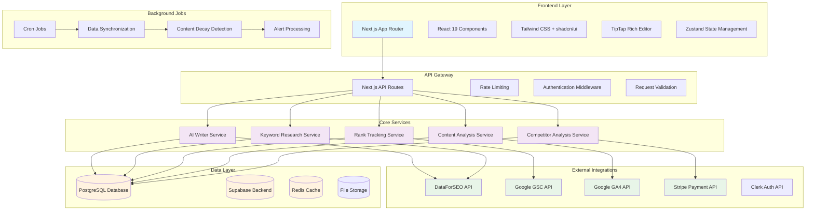
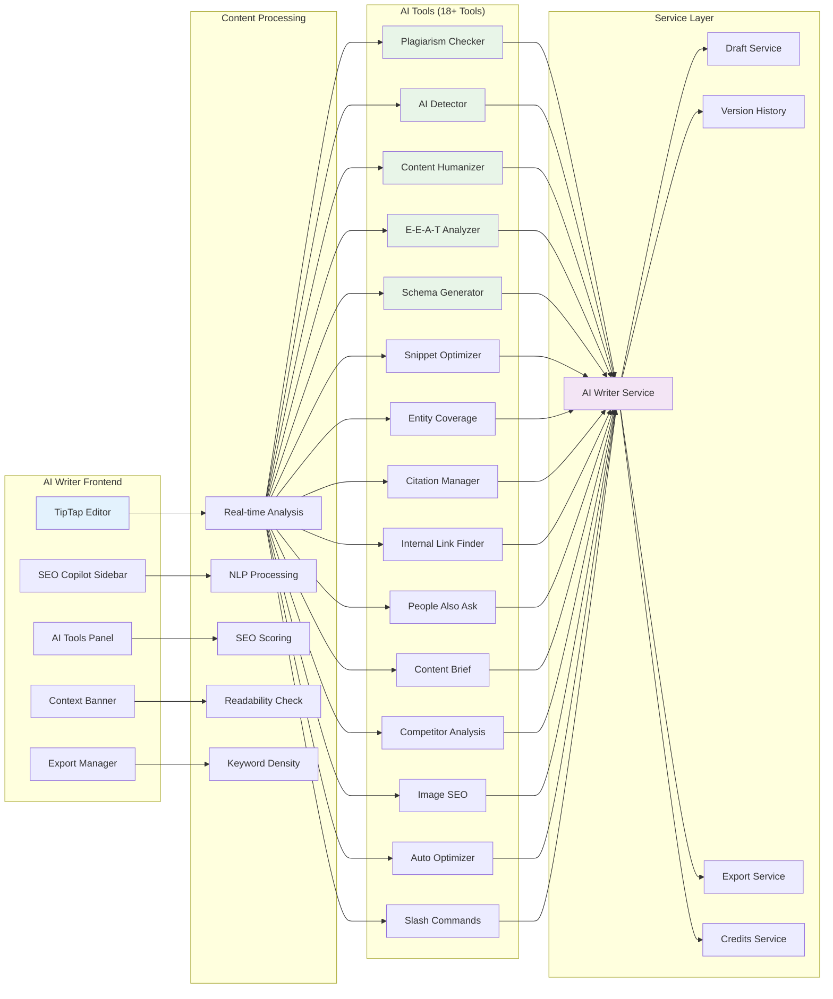
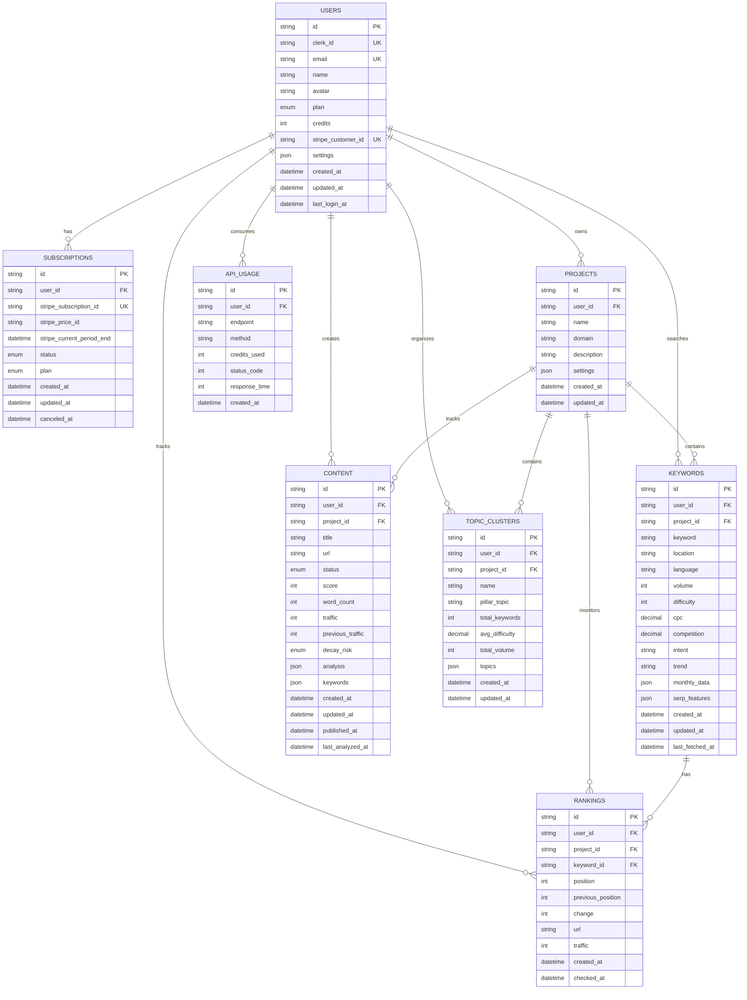
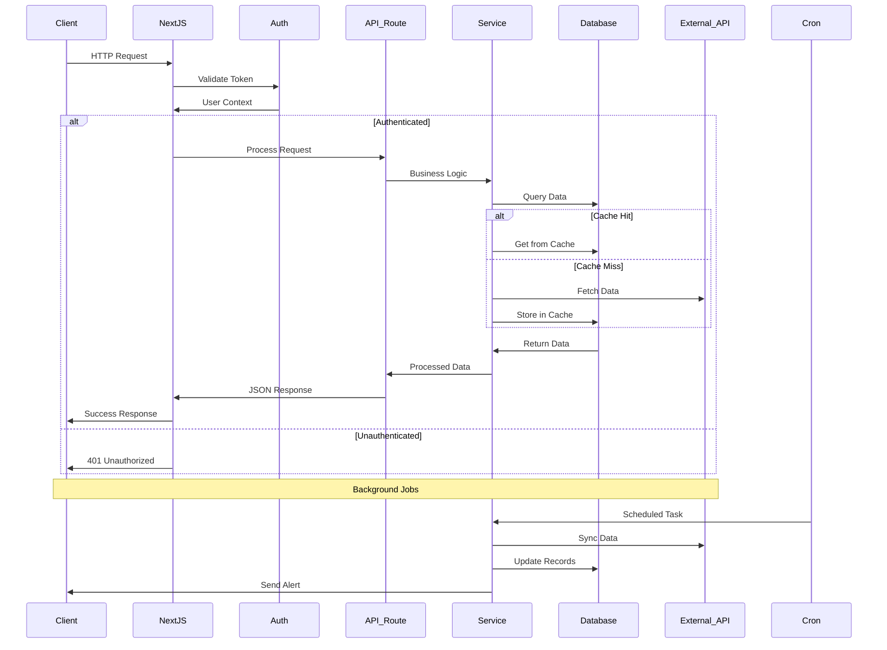
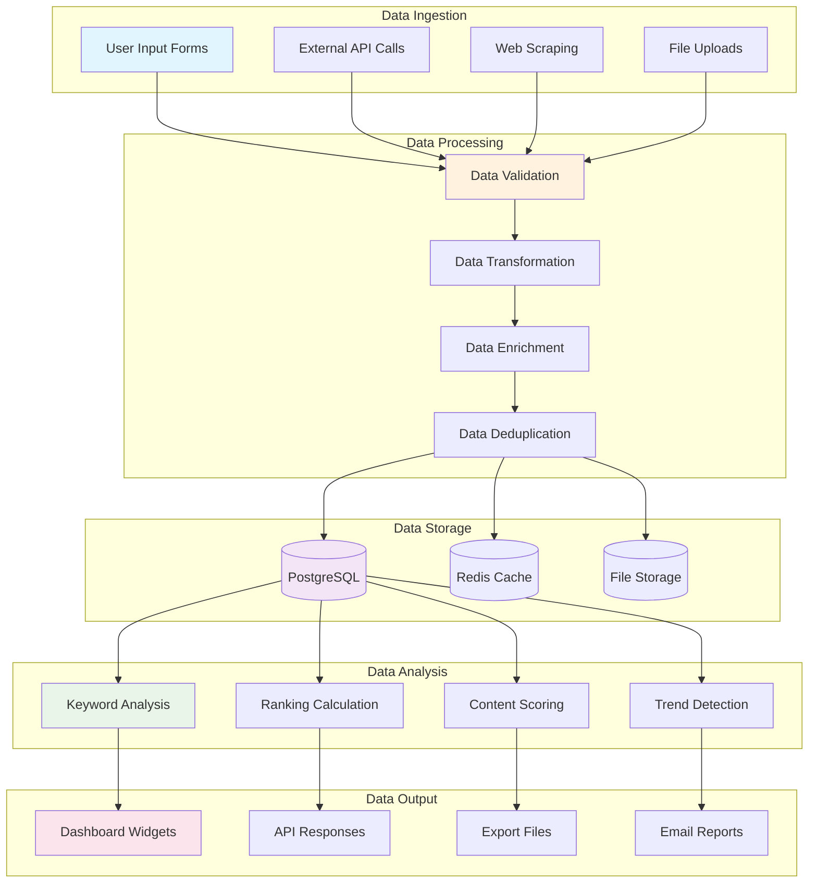
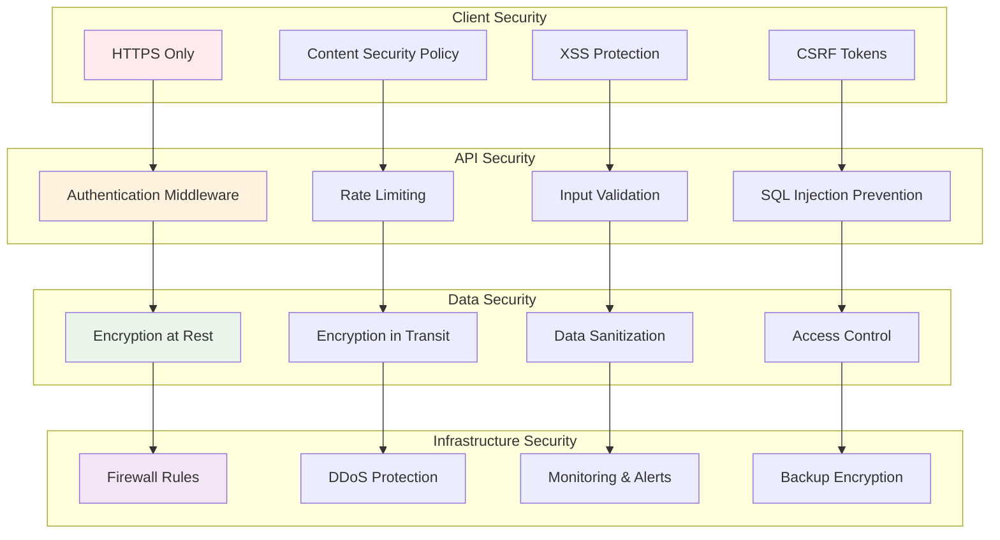
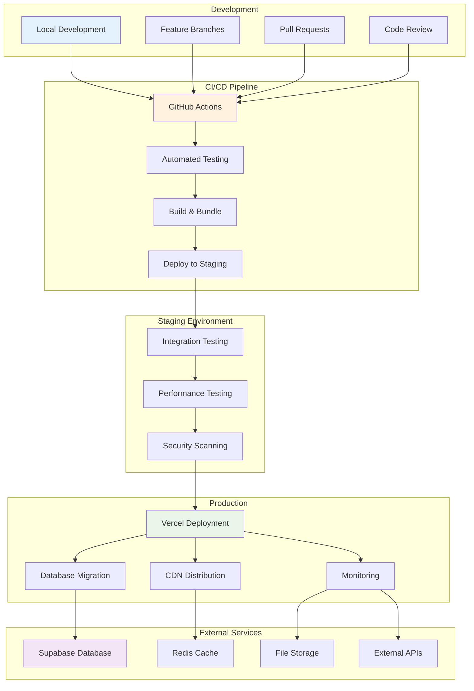
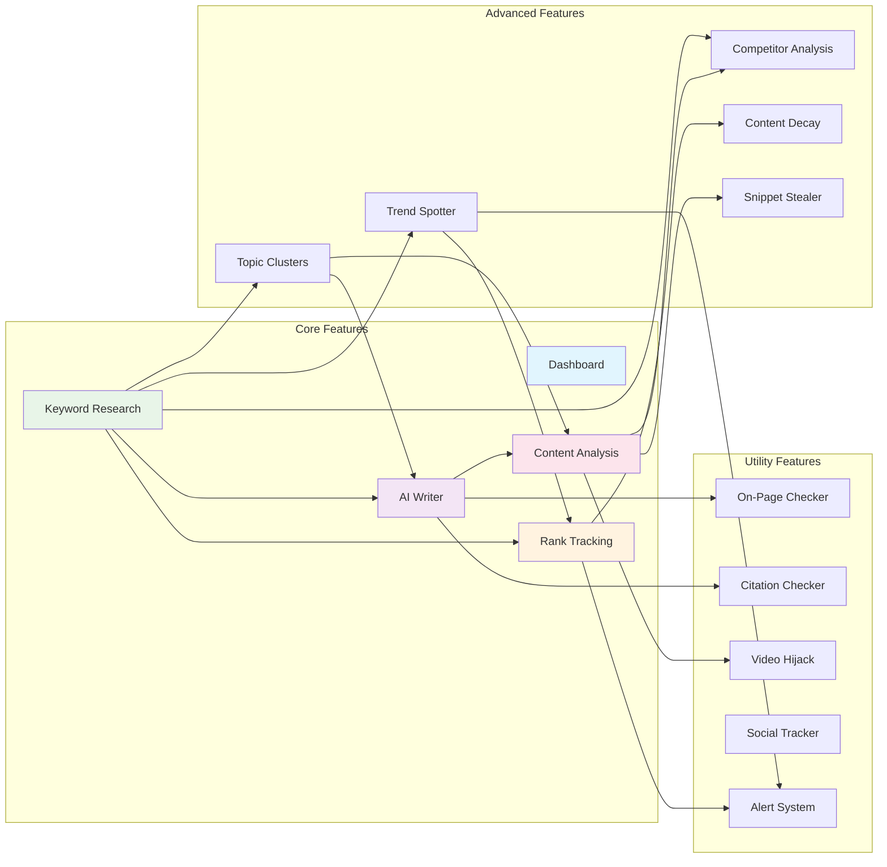

# BlogSpy System Architecture Diagram

## 🏗️ High-Level System Architecture

## 🤖 AI Writer System Architecture

## 🗄️ Database Schema Overview

## 🌐 API Architecture Flow

## 🔄 Data Flow Architecture

## 🛡️ Security Architecture

## 🚀 Deployment Architecture

## 📊 Feature Module Dependencies

## 🔧 Technology Stack Visualization

```mermaid
graph TB
    subgraph "Frontend Technologies"
        A[Next.js 16]
        B[React 19]
        C[TypeScript]
        D[Tailwind CSS]
        E[shadcn/ui]
        F[TipTap Editor]
    end

    subgraph "Backend Technologies"
        G[Node.js]
        H[Prisma ORM]
        I[PostgreSQL]
        J[Supabase]
        K[Redis]
        L[Next.js API Routes]
    end

    subgraph "External Services"
        M[DataForSEO]
        N[Google APIs]
        O[Stripe]
        P[Clerk]
        Q[Resend]
        R[Vercel]
    end

    subgraph "Development Tools"
        S[ESLint]
        T[Prettier]
        U[GitHub Actions]
        V[Jest]
        W[TypeScript Compiler]
    end

    A --> G
    B --> A
    C --> W
    D --> E
    E --> A
    F --> B

    G --> L
    H --> I
    I --> J
    J --> K

    L --> M
    L --> N
    L --> O
    L --> P
    L --> Q

    G --> R

    C --> S
    C --> T
    A --> U
    G --> V

    style A fill:#000000
    style B fill:#61dafb
    style C fill:#3178c6
    style D fill:#06b6d4
    style I fill:#336791
    style G fill:#339933
```

---

**Diagram Version**: 1.0  
**Last Updated**: December 21, 2024  
**Purpose**: Visual representation of BlogSpy system architecture  
**Format**: Mermaid diagrams for documentation and presentation