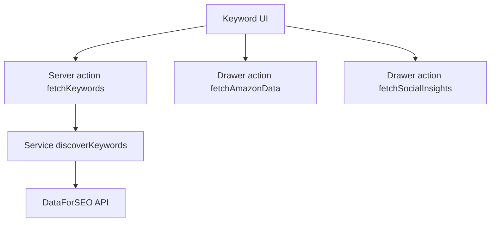

# Keyword Magic / Keyword Explorer — Forensic Audit Verdict

Scope: both user-facing routes [`app/dashboard/research/keyword-magic/page.tsx`](app/dashboard/research/keyword-magic/page.tsx:1) and [`app/keyword-magic/page.tsx`](app/keyword-magic/page.tsx:1), plus the shared feature entrypoint [`KeywordResearchContent()`](src/features/keyword-research/keyword-research-content.tsx:74) and its server actions/services.

## Executive Verdict

**NOT READY TO SHIP with real paid APIs enabled.**

Primary reason: the core server actions that can trigger paid upstream calls are currently implemented as **public (unauthenticated) server actions**, with comments indicating they were left in a dev/testing posture.

If `NEXT_PUBLIC_USE_MOCK_DATA` is ever `false` in a publicly accessible environment, this creates a direct FinOps + abuse risk (unbounded anonymous spend), and also makes it hard to enforce credit rules.

## CRITICAL Findings (must resolve before enabling real API mode)

### 1) Unauthenticated keyword search action can call paid DataForSEO

- The UI ultimately triggers [`fetchKeywords`](src/features/keyword-research/actions/fetch-keywords.ts:178), which is currently implemented with a public safe-action client via [`action`](lib/safe-action.ts:74) (comment: dev/testing).
- In real mode, [`fetchKeywords`](src/features/keyword-research/actions/fetch-keywords.ts:212) calls [`discoverKeywords()`](src/features/keyword-research/services/keyword-discovery.ts:137), which calls DataForSEO via [`getDataForSEOClient()`](src/lib/seo/dataforseo.ts:185).

Impact:
- Any anonymous user (including on the demo route [`app/keyword-magic/page.tsx`](app/keyword-magic/page.tsx:1)) can potentially execute paid upstream calls, unless blocked elsewhere.

Why this is CRITICAL:
- Direct cost exposure + abuse vector; cannot be mitigated reliably by UI gating.

### 2) Unauthenticated drawer data action can trigger external API calls

- Drawer data is fetched through [`fetchAmazonData`](src/features/keyword-research/actions/fetch-drawer-data.ts:86) and [`fetchSocialInsights`](src/features/keyword-research/actions/fetch-drawer-data.ts:205), also implemented via the public safe-action client imported as [`action`](src/features/keyword-research/actions/fetch-drawer-data.ts:15).
- Social insights fan out into external fetches via [`fetchYouTubeData()`](src/features/keyword-research/services/social.service.ts:1), [`fetchRedditData()`](src/features/keyword-research/services/social.service.ts:1), and [`fetchPinterestData()`](src/features/keyword-research/services/social.service.ts:1).

Impact:
- Anonymous traffic can induce upstream API calls (current implementation suggests mock mode + stubs, but the integration surface exists).

Why this is CRITICAL:
- Same cost/abuse problem as keyword search.

### 3) Duplicate safe-action implementations increase security drift risk

Two separate implementations exist with different exports/behavior:
- [`publicAction`](src/lib/safe-action.ts:115) and [`authAction`](src/lib/safe-action.ts:123) (includes Supabase auth + optional Upstash rate limit)
- [`action`](lib/safe-action.ts:74) and [`authAction`](lib/safe-action.ts:121) (different auth error semantics and a separate rate-limit wrapper)

Impact:
- Imports like [`action`](src/features/keyword-research/actions/fetch-keywords.ts:11) are easy to misroute across these two modules.
- This makes it more likely production paths unintentionally remain public or un-rate-limited.

Why this is CRITICAL:
- Auth/rate-limit policy becomes inconsistent across actions, causing silent security regressions.

## High Confidence Product / UX Notes

### Demo/Guest mode

- The feature treats users as guest by default and then checks Supabase auth client-side in [`KeywordResearchContent()`](src/features/keyword-research/keyword-research-content.tsx:74).
- This is fine for PLG, but creates a brief “Demo Mode” banner flash for logged-in users until auth resolves.

### Drawer UX

- Drawer implementation is robust: it uses an [`ErrorBoundary`](src/features/keyword-research/components/drawers/KeywordDetailsDrawer.tsx:202) per-tab and keeps the shell stable.
- Potential route gap: footer links to a Deep GEO report under [`/dashboard/research/geo-report/...`](src/features/keyword-research/components/drawers/KeywordDetailsDrawer.tsx:225); verify that route exists and is gated appropriately.

## Correctness Notes (based on inspected code)

### Data mapping

- DataForSEO Labs related keywords mapping is implemented in [`discoverKeywords()`](src/features/keyword-research/services/keyword-discovery.ts:137).
- Intent mapping is defensive via [`mapIntent()`](src/features/keyword-research/services/keyword-discovery.ts:48).
- Competition/KD normalization is defensive via [`parseCompetitionLevel()`](src/features/keyword-research/services/keyword-discovery.ts:80).

### Client-side filtering

- Filtering is applied via [`applyAllFilters()`](src/features/keyword-research/keyword-research-content.tsx:160), which delegates to the filtering engine in [`src/features/keyword-research/utils/filter-utils.ts`](src/features/keyword-research/utils/filter-utils.ts:1).
- This is reasonable for the current “fetch big batch then filter in UI” design, but increases client CPU for large lists.

## Performance / FinOps Notes

- DataForSEO calls are server-side in [`discoverKeywords()`](src/features/keyword-research/services/keyword-discovery.ts:137) and rely on shared Axios singleton via [`getDataForSEOClient()`](src/lib/seo/dataforseo.ts:185).
- The call uses a batch limit of up to 500 (`batchLimit`) in [`discoverKeywords()`](src/features/keyword-research/services/keyword-discovery.ts:168), which is sensible for UI filtering headroom, but increases cost if invoked frequently.

Key constraint: until auth + credit enforcement is consistent, it is unsafe to expose these actions publicly.

## Architecture Snapshot

Relevant entrypoints:
- UI composition: [`KeywordResearchResults()`](src/features/keyword-research/components/page-sections/KeywordResearchResults.tsx:25) → [`KeywordTable`](src/features/keyword-research/components/page-sections/KeywordResearchResults.tsx:93) + [`KeywordDrawer`](src/features/keyword-research/components/page-sections/KeywordResearchResults.tsx:102)
- Search action: [`fetchKeywords`](src/features/keyword-research/actions/fetch-keywords.ts:178)
- Upstream client: [`getDataForSEOClient()`](src/lib/seo/dataforseo.ts:185)

## Recommendations (no code changes applied in this audit)

### Must-do before enabling real API mode

1) Enforce authenticated execution for paid actions
- Switch keyword search and drawer actions to authenticated safe-actions (use a single canonical module).
- Ensure rate limiting is active on those auth-required actions.

2) Centralize safe-action exports
- Choose one: [`src/lib/safe-action.ts`](src/lib/safe-action.ts:1) or [`lib/safe-action.ts`](lib/safe-action.ts:1), and remove/alias the other to prevent drift.

3) Make mock-mode gating server-side and non-public
- Treat `NEXT_PUBLIC_USE_MOCK_DATA` as a UI hint only; do not allow it to decide whether to permit paid calls without auth.

## Final Scorecard

- Security/auth policy: **Fail (CRITICAL)**
- FinOps/cost containment: **Fail (CRITICAL)**
- Data correctness (mapping): **Pass (observed)**
- UI resilience (drawer boundaries): **Pass (observed)**
- Maintainability (duplication/drift): **Needs work**

Verdict: **Hold shipping paid-mode** until CRITICAL findings are addressed.

## CRITICAL Fix Shortlist (for implementation mode)

Goal: make it impossible for anonymous traffic to trigger paid upstream calls, and eliminate safe-action drift.

1) Make paid-mode keyword search authenticated
- Change [`fetchKeywords`](src/features/keyword-research/actions/fetch-keywords.ts:178) to use an authenticated safe-action client (prefer [`authAction`](src/lib/safe-action.ts:123) from the canonical module) instead of the public [`action`](lib/safe-action.ts:74).
- Decide the rule for demo route [`app/keyword-magic/page.tsx`](app/keyword-magic/page.tsx:1):
  - Option A: keep demo entirely mock-only (server-enforced), and hard-fail real mode when unauthenticated.
  - Option B: allow a strict anonymous quota via server-side rate-limiting keyed by IP (still risky).

2) Make drawer data actions authenticated (or server-enforced mock-only)
- For [`fetchAmazonData`](src/features/keyword-research/actions/fetch-drawer-data.ts:86) and [`fetchSocialInsights`](src/features/keyword-research/actions/fetch-drawer-data.ts:205), require auth using [`authAction`](src/lib/safe-action.ts:123), or enforce mock-only on the demo route.
- Ensure fan-out calls in [`social.service.ts`](src/features/keyword-research/services/social.service.ts:1) are only reachable through the authenticated action path.

3) Canonicalize safe-action module (remove ambiguity)
- Pick one module as canonical and update imports across the feature:
  - Canonical candidate: [`src/lib/safe-action.ts`](src/lib/safe-action.ts:1) (has explicit [`publicAction`](src/lib/safe-action.ts:115) + [`authAction`](src/lib/safe-action.ts:123)).
- Then:
  - Replace `import { action } from "@/lib/safe-action"` in feature actions with the canonical export.
  - Either delete/stop using [`lib/safe-action.ts`](lib/safe-action.ts:1) or turn it into a thin re-export to the canonical module to prevent drift.

4) Enforce mock-mode gating server-side (do not trust NEXT_PUBLIC)
- In server actions like [`fetchKeywords`](src/features/keyword-research/actions/fetch-keywords.ts:178) and [`fetchSocialInsights`](src/features/keyword-research/actions/fetch-drawer-data.ts:205), treat `NEXT_PUBLIC_USE_MOCK_DATA` as a UI/dev toggle only.
- Add a server-side guard: if unauthenticated and real mode requested, return an explicit unauthorized / upgrade-required response.

5) Add minimal automated checks
- Add a test or lint rule that rejects `publicAction` usage in any action that calls DataForSEO (e.g., anything touching [`getDataForSEOClient()`](src/lib/seo/dataforseo.ts:185)).
- Add a smoke test ensuring demo route cannot call real DataForSEO endpoints without auth.

6) Post-fix verification
- Run `npm run build` after changes.
- Manually verify that demo route still works in mock mode and that dashboard route works for authenticated users.
