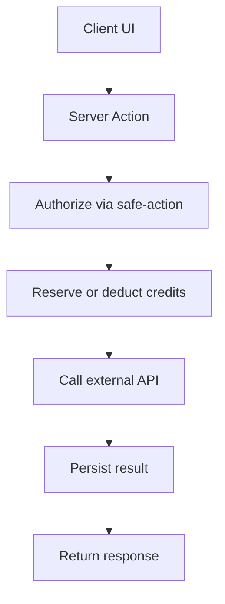

# MASTER_REFACTOR_PLAN.md — Template (BlogSpy)

## Purpose
Create a single, repo-root refactor plan that:
- Rates each major area 🔴/🟡/🟢
- Lists actionable TODOs (with file anchors)
- Prioritizes correctness/security/billing first, then module boundaries, then DX/tests

---

## Rating rubric
- 🔴 Critical (ship blocker)
  - Security/auth bypass or broken route protection
  - Billing/credits incorrect or race-prone
  - Server Actions allow unauthenticated access to privileged operations
  - Production build fragility (frequent breakage, duplicate sources of truth)
  - Data access layer confusion that risks wrong tenant data

- 🟡 Warning (refactor needed)
  - Duplicate abstractions, inconsistent patterns across features
  - Boundary violations (`lib/*` vs `src/lib/*`), barrels causing type drift
  - Missing tests for core business logic
  - Mock gating inconsistent, config scattered

- 🟢 Acceptable
  - Clear ownership, stable build, consistent patterns
  - Small localized improvements only

---

## Output structure for `MASTER_REFACTOR_PLAN.md`

### 0) Executive summary
- 3–6 bullets: the most important blockers and the overall direction.

### 1) Repo-wide ratings table
| Area | Rating | Why | Key links |
|---|---:|---|---|
| `app/` | 🟡 | … | … |
| `src/features/keyword-research/` | 🔴 | … | … |
| `lib/` | 🔴 | … | [`lib/safe-action.ts`](lib/safe-action.ts:1) |
| `src/lib/` | 🔴 | … | [`src/lib/safe-action.ts`](src/lib/safe-action.ts:1) |
| `services/` | 🟡 | … | … |
| `store/` | 🟡 | … | … |
| `prisma/` | 🟡 | … | [`prisma/schema.prisma`](prisma/schema.prisma:1) |
| `supabase/` | 🔴 | … | [`supabase/migrations/002_user_credits_system.sql`](supabase/migrations/002_user_credits_system.sql:1) |

### 2) Global architecture findings
#### 2.1 Routing + route protection
- Current state:
  - `proxy.ts` exists but not wired as Next middleware; note `isDemoMode = true` → protection not enforced.
  - Links: [`proxy.ts`](proxy.ts:1)
- Decision:
  - Choose one: implement actual middleware; or remove proxy and enforce protection at layout + server actions.

#### 2.2 Server Actions standard
- Identify and standardize on exactly one safe-action wrapper.
  - Duplication today: [`lib/safe-action.ts`](lib/safe-action.ts:1) vs [`src/lib/safe-action.ts`](src/lib/safe-action.ts:1)

#### 2.3 Supabase server client standard
- Standardize server client import surface.
  - Current: [`lib/supabase/server.ts`](lib/supabase/server.ts:1)

#### 2.4 Mock gating and env config
- Normalize to a single env flag and a single helper.
- Ensure client-only flags do not control server-only behavior.

### 3) Billing/Credits correctness model
- Source of truth: `user_credits` + `use_credits` RPC.
  - Links: [`supabase/migrations/002_user_credits_system.sql`](supabase/migrations/002_user_credits_system.sql:1)
- Required semantics:
  - Reserve/deduct should be atomic if needed (avoid race conditions).
  - Every deduction must log `credit_usage_history`.

### 4) Test strategy (guardrails for refactors)
#### 4.1 Unit tests (pure logic)
- Target:
  - Credits helpers (remaining calculation, plan limits interpretation)
  - Deterministic scoring utilities (SERP feature parsing, GEO score calculations, etc.)
- Guidance:
  - Keep tests small and pure; avoid hitting Supabase/DataForSEO.

#### 4.2 Contract tests (auth + credits invariants)
- Auth invariants:
  - Any `authAction`-protected server action rejects unauthenticated requests.
  - Any admin-only server action rejects non-admin roles.
- Credits invariants:
  - `use_credits` rejects when remaining < amount.
  - Every successful deduction creates a `credit_usage_history` row.
- How to implement:
  - Prefer a thin adapter around Supabase calls so you can inject a test double.
  - Where direct DB testing is needed, run it as an opt-in script in CI/dev.

#### 4.3 Smoke tests (build-time)
- `npm run build` must pass.
- Minimal route render tests for `app/dashboard/*` pages that load server components.

### 5) Feature-by-feature scorecards
For each `src/features/*`:
- Rating
- What works
- What’s risky
- TODOs

Example:
#### `src/features/keyword-research/`
- Rating: 🔴
- Findings:
  - Credits charged after API call; no reserve, race risk.
  - Mixed mock flags across layers.
- Anchors:
  - [`src/features/keyword-research/actions/refresh-keyword.ts`](src/features/keyword-research/actions/refresh-keyword.ts:1)

---

## Required TODO format
- 🔴 TODO 1: Title
  - Why it matters
  - Concrete action
  - Acceptance criteria
  - Anchors

- 🟡 TODO 1: Title
  - …

---

## Non-goals
- Cosmetic UI changes unless they reduce bugs/regressions.
- Broad performance work unless it impacts correctness or build stability.
